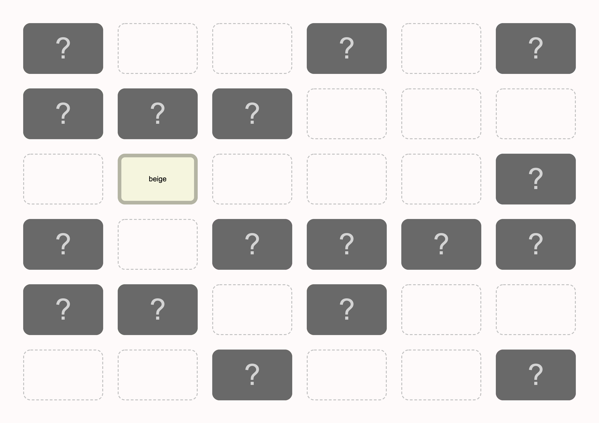

warsawjs-workshop-59-introduction-to-frontend
=============================================

[WarsawJS Workshop #59](https://warsawjs.com/workshops) project: an example implementation of the ["memory" game](https://en.wikipedia.org/wiki/Concentration_(card_game)).

Preparation
-----------

1. **Fork** this repository on GitHub. ([How to fork a repo on GitHub?](https://help.github.com/en/articles/fork-a-repo))

2. **Clone** your fork of the repository. ([How to clone a repo from GitHub?](https://help.github.com/en/articles/cloning-a-repository))

3. Install npm packages:

```shell
npm install
```

4. Start the app:

```shell
npm start
```

5. Open the app in a web browser: `http://localhost:8080`

6. Run tests:

```shell
npm test
```

Workshop
--------

The goal is to implement a simple version of the ["memory" game](https://en.wikipedia.org/wiki/Concentration_(card_game)).

Git branches
------------

- `main` - a starting point: empty files to be edited
- `complete` - a complete, example implementation

Example implementation screenshot
---------------------------------


